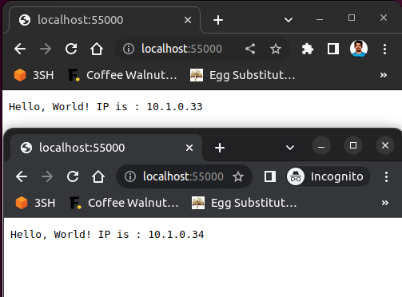

# Equal Experts Challenge

## Question

### Mini Kube
Write a simple hello world application in any one of these languages: Python, Ruby, Go. Build the application within a Docker container and then load balance the application within Minikube. You are not required to automate the installation of Minikube on the host machine.

## Answer: Hello World Python Application

This is a simple "Hello, World!" application that is written in Python and uses Docker as a Container service. The application displays a Hello, World! webpage under the URL http://localhost:55000 when the docker image is executed. This application can also be deployed into the Kubernetes using the "helloworld.yaml" file.

## Requirements
- Python 3.9
- Docker (latest version)
- Minikube (latest version)

## Prerequisite
Docker and Minikube should be up and running. The Docker environment must be set to the Minikube. This can be configured by running the command below.

```sh
eval $(minikube docker-env)
```
or
```sh
minikube -p minikube docker-env
```

## How to run

As mentioned in the requirements, it is important that Docker and Minikube are working fine and have enough memory to launch the required pods before running the application. I assume that the user knows how to use these two tools in general.

The Docker image can be built locally by running the following command.
```sh
docker build -t house3sh/python-helloworld:1.0 .
```

The same image has been uploaded to the public repository in the Docker Hub as [python-helloworld](https://hub.docker.com/r/house3sh/python-helloworld). The image can be pulled to the local machine by running the given command. This is a public repository
```sh
docker pull house3sh/python-helloworld:1.0
```

To create a simple deployment of this application with 4 replicas that are load balanced in the Minikube Kubernetes cluster, run the following command.
```sh
kubectl create -f helloworld.yaml
```

The Kubectl must identify the required service & deployment from the YAML file and run the required services automatically into the Minikube environment. The following command will describe the services.
```sh
kubectl get deployments,svc helloworld
```

The output will be as given below.
```sh
sri$ kubectl get deployment,svc helloworld
NAME                         READY   UP-TO-DATE   AVAILABLE   AGE
deployment.apps/helloworld   2/2     2            2           3m34s

NAME                 TYPE           CLUSTER-IP     EXTERNAL-IP   PORT(S)           AGE
service/helloworld   LoadBalancer   10.99.89.160   localhost     55000:30620/TCP   3m34s
```
As shown above, the Hellow World application will be accessible under the URL http://localhost:55000. The ports are chosen as configured in the YAML file that we used to deploy the application into the Minikube environment.

The application can be scaled up and down by changing the replica count in the command given below. Replace the `<desired-count>` with the integer value of your choice.
```sh
kubectl scale deployment helloworld --replicas=<desired-count>
```

To list the pods, use the below command. The output is also given for reference
```sh
sri$ kubectl scale deployment helloworld --replicas=3
deployment.apps/helloworld scaled
sri$ kubectl get pods
NAME                          READY   STATUS    RESTARTS   AGE
helloworld-74857fd9b4-69c6h   1/1     Running   0          44s
helloworld-74857fd9b4-fs5dd   1/1     Running   0          8m35s
helloworld-74857fd9b4-lqspt   1/1     Running   0          9m4s
```

You can test the load-balanced request by opening the URL http://localhost:55000 on the normal browser window and in the incognito window simultaneously. You can see the different local IP addresses from the pod on both windows. A sample browser output can be seen in the screenshot.



The command below will help you to clean up the service. This command will again refer to the YAML file for the kinds of service being run in the Minikube environment and then delete them accordingly,
```sh
kubectl delete -f helloworld.yaml
```
